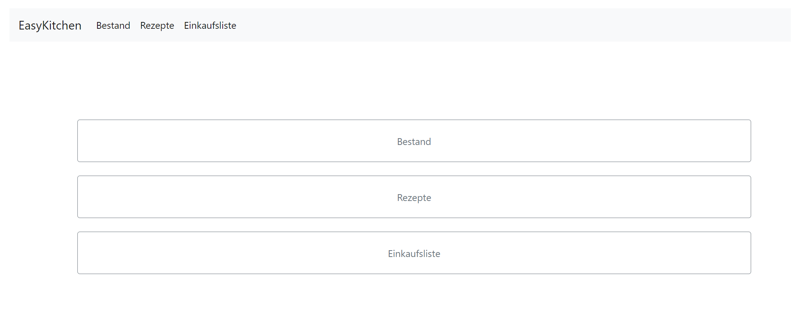
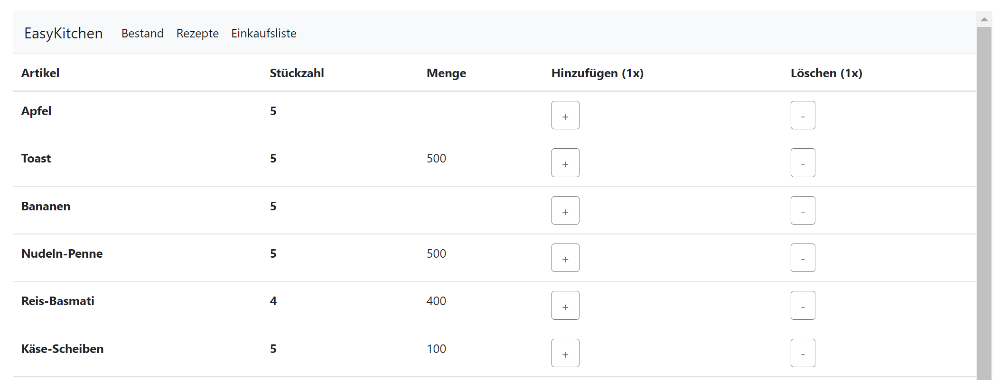
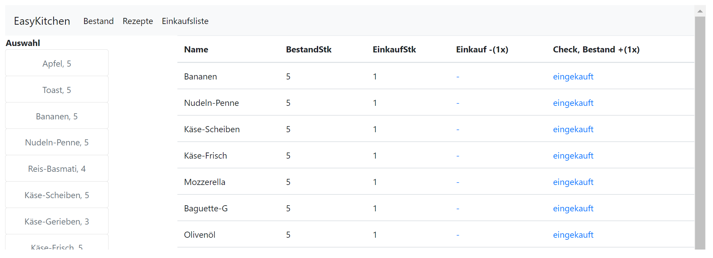
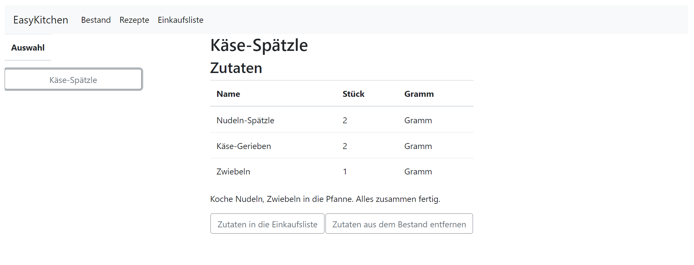

# IPR-EasyKitchen

Small project for the Internet Programming course. This was the first web project in the Computer Science study.
Everything was new, and it was like a tutorial for web development.

In has an in-build database with a snapshot of some data.

## Components

### Home

### Storage

### Shopping List

### Recipe

